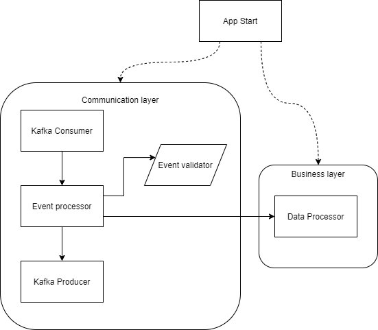

TODO: redo the event library

## Introduction
The aim of this case study is to show how metadata validation can be achieved in an event based Kafka application.

The case study uses the Event library to carry out metadata validation.
It demonstrate an example of how to use the Event library to validate Event metadata in a Kafka messaging application.

NB: The purpose of the Event library is to provide:
-A defined structure for events and event metadata.
-Metadata validation.

## Prerequisites
Some experience of using Kafka. 

## Start up
-run "docker-compose up -d --build" in the solution folder to setup the environment required to have a kafka broker working.
-add nuget package source [redo the nuget] and intall the event library in AppStart and PopulateInputTopic 

## Architecture 

### Layers  
Communication: layer taking care of everything related to communication with other systems. It will include unwrapping the protocols and message validation.  
Business: layer containing all the business logic. It should have no dependency on other layers.  
  
### Application parts  
App Start: Part of the solution initialising the application. It is where you can find the dependency injection, the configuration setting of the application.  
Kafka consumer: everything related to consuming message from Kafka  
Kafka producer: everything related to producing messages to Kafka  
Data processor: apply business logic to the data. It does not know what is an event or kafka  
Event validator: present in the event library, it validates an event. Once validated the data can be processed  
Event processor: coordinate the different steps which are happening in an event processing. It will validate the event and decide what will be the next steps to follow. The event processor is responsible to deserialise the data to pass it to the data processor. 